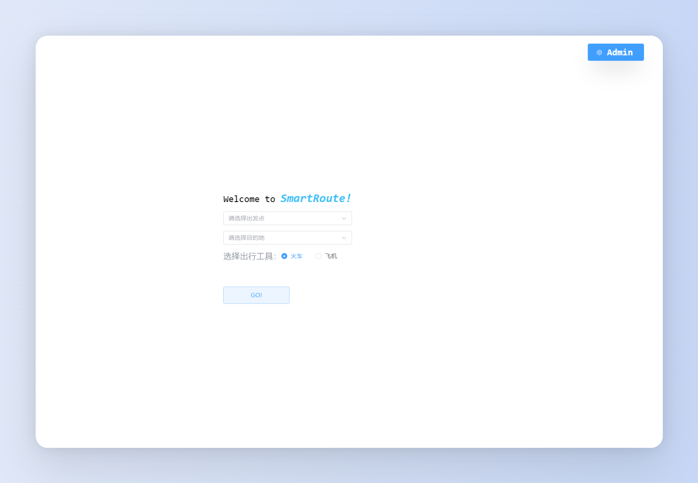
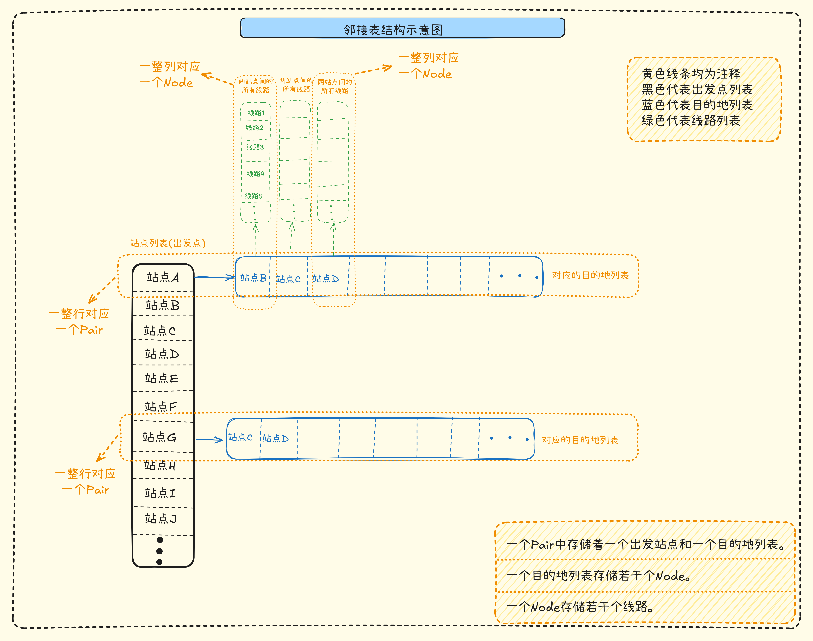

# SmartRoute
SmartRoute 是一个智能路线规划系统，提供高效、便捷的路径规划服务，支持自定义站点与路线数据的导入和管理。

### 技术栈
- 前端：Vue3、Vite、Element Plus、TypeScript、TailwindCSS
- 后端：C++、CrowCpp、NlohmannJson、fkYAML、CMake

## 运行样例


## 项目结构
``` shell
.
├── build.bat                     // 编译整个项目的bat脚本
├── build_backend.bat             // 编译后端的bat脚本
├── build_frontend.bat            // 编译前端的bat脚本
├── start.bat                     // 编译后的app启动脚本
├── CMakeLists.txt                // Cmake配置文件
├── README.md                     // 项目README
├── LICENSE                       // MIT 开源许可证
│
├── app                           // (文件夹) 存放整个项目编译后的最终可执行文件
├── build                         // (文件夹) 存放Cmake编译链接后的文件
│
├── config                        // (文件夹) 存放SmartRoute的配置文件
│   └── config.yaml               // SmartRoute的配置文件
├── data                          // (文件夹) 存放SmartRoute的数据文件
│   ├── cities.json               // 站点数据文件
│   └── routes.json               // 线路数据文件
├── docs                          // 存放项目文档
├── include                       // 后端使用的第三方库
│   ├── asio                      // CrowCpp依赖的独立ASIO库
│   ├── crow                      // CrowCpp后端框架库
│   ├── fkYAML                    // 用于支持读写yaml格式配置文件的库
│   └── nlohmann                  // 用于支持读写json格式数据文件的库
├── logs                          // 存放服务器运行的日志
├── src                           // (文件夹) 存放后端所有源代码
│   ├── graph                     // (文件夹) 存放与图数据结构相关的模块
│   │   ├── graph.h               // 图数据结构的相关数据类型定义
│   │   └── graph.hpp             // 图数据结构的实现
│   ├── main                      // (文件夹) 存放main.cpp的头文件和实现
│   │   ├── main.h                // main.cpp所需的函数签名
│   │   └── main.hpp              // mian.h的函数实现
│   ├── main.cpp                  // 后端的主入口
│   ├── module                    // (文件夹)定义项目所需的数据模型
│   │   ├── constants.h           // 存放自定义的常量数据
│   │   ├── module.h              // 存放SmartRotue相关的数据模型定义
│   │   └── module.hpp            // 模型的具体实现
│   ├── server                    // (文件夹) 存放实现后端所需的源文件
│   │   ├── server.h              // 定义服务器模型
│   │   └── server.hpp            // 服务器模型的具体实现
│   ├── system                    // (文件夹) 存放SmartRoute项目系统相关的源代码
│   │   ├── system.h              // SmartRoute系统数据模型定义
│   │   └── system.hpp            // SmartRoute系统的具体实现
│   └── utils                     // (文件夹) 存放必要的实用操作函数的源代码
│       ├── jsonTool.hpp          // 存放与json相关的实用组件
│       ├── webTool.hpp           // 存放与web相关的实用组件
│       └── yamlTool.hpp          // 存放与yaml相关的实用组件
└── web                           // (文件夹) 存放前端的工程文件夹
    └── dist                      // (文件夹) 前端编译构建好的最终文件

```

## 邻接表结构


## 快速上手
### 方法一（推荐）
1. 下载 [Release](https://github.com/lin-snow/SmartRoute/releases) 中的完整可执行文件；
2. 解压缩后，双击运行 `start.bat` 启动服务；
3. 打开浏览器，访问 [http://127.0.0.1:23333](http://127.0.0.1:23333) 即可使用。

### 方法二
1. 配置环境：安装 [`Mingw64`](https://www.mingw-w64.org/)、[`Cmake`](https://cmake.org/) 和 [`Nodejs`](https://nodejs.org/)；
2. 克隆项目：`git clone https://github.com/lin-snow/SmartRoute.git`；
3. 安装前端依赖：进入 `web` 目录运行 `npm install`；
4. 编译项目：在根目录运行 `build.bat`；
5. 访问项目：启动服务后，打开浏览器访问 [http://127.0.0.1:23333](http://127.0.0.1:23333)。

## TODOS
### 功能优化
- [x] 基本功能实现
- [ ] 支持多维度路线优化：最省时、最经济、最少换乘
- [ ] 增加日志模块，记录用户操作和系统状态
- [ ] 优化用户界面与交互体验（UI/UX）

### 新特性
- [ ] 提供一键安装环境的脚本
- [ ] ~~支持多平台运行（Windows/Linux/MacOS）~~
- [ ] 路线规划完成后提供预定功能（暂缓）
 

## 为什么会有SmartRoute?
本项目起源于本鼠鼠的大二数据结构课设中的一个题目，由于本人不会qt，然后又在往后端开发发展，所以索性拿这个课设过一下前后端开发，算是一次练习吧！

## 为什么要使用C++开发后端呢？
一是出于好奇，想尝试一下什么体验，二是可以顺便学一学Cmake和Cpp等。

# 致谢
感谢以下工具、库和平台的支持，让 SmartRoute 的开发成为可能：

- [Asio](https://think-async.com/Asio)：高性能异步网络编程库。
- [CrowCpp](https://github.com/CrowCpp/Crow)：轻量级、高效的 Web 微框架。
- [Nlohmann Json](https://github.com/nlohmann/json)：现代化的 C++ JSON 库。
- [fkYAML](https://github.com/fktn-k/fkYAML)：简洁优雅的 C++ YAML 库。
- [CMake](https://cmake.org/)：跨平台构建工具，简化项目编译。
- [MinGW-w64](https://www.mingw-w64.org/)：Windows 下的 C++ 编译器。
- [Node.js](https://nodejs.org/)：支持前端开发的高效运行环境。
- [Vue.js](https://vuejs.org/)、[TailwindCSS](https://tailwindcss.com/)、[Element Plus](https://element-plus.org/)：赋能前端开发的三件套。
- [GitHub](https://github.com/)：提供代码托管。
- [AI]() : 帮助设计、理清思路和debug等。